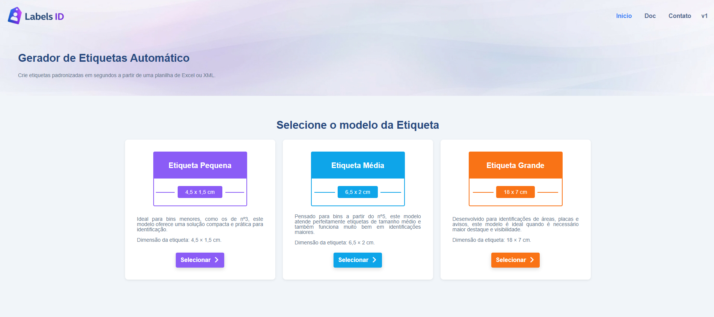
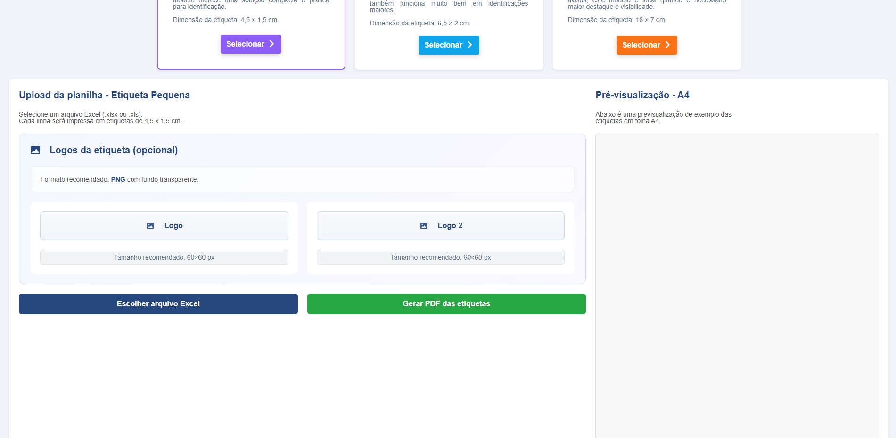
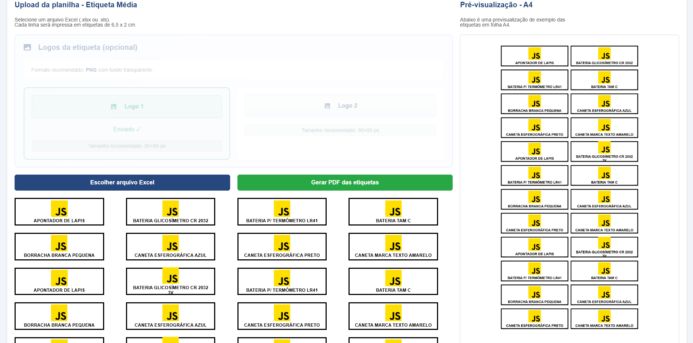

# LabelsID

**Gerador de Etiquetas Automático** — crie etiquetas padronizadas em segundos a partir de uma planilha Excel.

---

## 🔗 Link do projeto

> **Em produção:** [www.labelsid.com.br](#)

---

## 📸 Screenshots

### Tela inicial — Seleção do modelo de etiqueta



### Upload de planilha e logos



### Pré-visualização e geração do PDF



---

## Sobre o projeto

O **LabelsID** é uma aplicação web que gera etiquetas em PDF a partir de um arquivo Excel. Você escolhe o tamanho da etiqueta, opcionalmente envia até duas logos em PNG e seleciona a planilha; cada linha vira uma etiqueta. O PDF é gerado no formato A4, pronto para impressão.

### Funcionalidades

- **Três modelos de etiqueta**
  - **Pequena:** 4,5 × 1,5 cm — ideal para bins menores
  - **Média:** 6,5 × 2 cm — bins médios e identificações
  - **Grande (Placa):** 18 × 7 cm — placas e avisos

- **Upload de logos** — até 2 imagens PNG por etiqueta (com tamanhos recomendados por modelo)

- **Planilha Excel** — uma linha = uma etiqueta; várias colunas são unidas com " - "

- **Pré-visualização em A4** — visualize como as etiquetas ficarão antes de gerar o PDF

- **Documentação** — página com instruções de uso, formato da planilha e especificações das imagens

### Tecnologias

- HTML5, CSS3, JavaScript
- [SheetJS (xlsx)](https://sheetjs.com/) — leitura de arquivos Excel
- [html2canvas](https://html2canvas.hertzen.com/) — captura das etiquetas para o PDF
- [jsPDF](https://github.com/parallax/jsPDF) — geração do PDF

---

## Como rodar localmente

1. Clone o repositório:

   ```bash
   git clone https://github.com/seu-usuario/labelsID.git
   cd labelsID
   ```

2. Sirva os arquivos com um servidor local (por exemplo):

   ```bash
   npx serve .
   ```

   **Importante:** use sempre um servidor local. Os links usam caminhos absolutos (`/style/`, `/js/`, etc.) e o gerador depende de módulos ES.

3. Acesse: `http://localhost:3000` — rotas sem `.html`: `/doc/`, `/privacidade/`, `/termos/`, `/sobre/`.

---

## Documentação

A documentação de uso está na própria aplicação, no menu **Doc**, e inclui:

- Passo a passo de como usar
- Modelos de etiqueta e dimensões
- Como preparar a planilha Excel
- Especificações das logos (formato PNG e tamanhos recomendados: 60×60 px, 80×80 px, 150×80 px)
- Dicas de uso

---

## Estrutura do projeto

```
labelsID/
├── index.html              # /
├── doc/index.html          # /doc/
├── privacidade/index.html  # /privacidade/
├── termos/index.html       # /termos/
├── sobre/index.html        # /sobre/
├── _redirects              # Netlify: redireciona *.html antigo
├── vercel.json             # Vercel: idem
├── .htaccess               # Apache: idem
├── js/
│   ├── app.js                 # Entrada (módulo ES)
│   ├── config/constants.js   # Tamanhos e IDs de upload
│   ├── utils/helpers.js       # escapeHtml, getSize
│   ├── ui/                    # Modais (app + edição de etiqueta)
│   ├── services/pdf.js        # Pré-visualização e geração de PDF
│   └── features/              # Upload/planilha, seleção de modelo, nav
├── style/
│   ├── style.css              # Folha principal (@import de tudo)
│   ├── util/                  # color, tipografia, bin (cards), buttons
│   ├── global/                # reset-base, main-section, modal, header, footer
│   ├── home/                  # layout, upload-logos, labels
│   └── docs/                  # doc.css
├── assets/
└── docs/
```

**Produção:** o site assume domínio na **raiz** (ex.: `labelsid.com.br`). Se publicar em **subpasta** (`usuario.github.io/repo/`), será preciso ajustar `<base href="...">` ou os caminhos. **AdSense:** URL da política → `https://seu-dominio/privacidade/`.

---

## Autor

**Michael Douglas**  
[LinkedIn](https://www.linkedin.com/in/michaeldwl) · [GitHub](https://www.github.com/michaeldwl)

---

## Licença

Este projeto é **gratuito para estudo e uso pessoal**. Uso comercial não é permitido — ninguém pode ganhar dinheiro com este software sem autorização. Veja a [página de licença](docs/license.html) ou o arquivo [LICENSE](LICENSE) para os termos completos.
